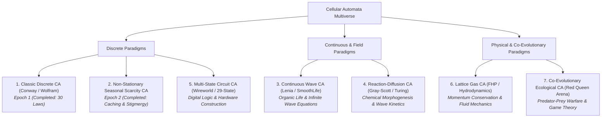

# The 7 Universes of Cellular Automata: Comprehensive Theoretical Taxonomy

This document outlines the complete mathematical, physical, and computational taxonomy of the **7 Fundamental Universes of Cellular Automata** known in complex systems theory, artificial life, and theoretical physics.

---

## Multiverse Architectural Hierarchy

---

## 1. The Classic Discrete Universe (Conway / Wolfram) — *[Completed: Epoch 1]*

### Physical Formulation
* **State Space**: Binary discrete lattice $s(x, y) \in \{0, 1\}$.
* **Neighborhood**: 8-cell Moore neighborhood $\mathcal{N}(x, y)$.
* **Transition Function**:
  $$s_{t+1}(x, y) = f\left(s_t(x, y), \sum_{(i,j) \in \mathcal{N}} s_t(i, j)\right)$$
* **Characteristic Physics**: Conway Life ($B3/S23$), HighLife ($B36/S23$), Day & Night ($B3678/S34678$).

### Emergent Phenomena
* Gliders, oscillators (blinkers, pulsars), still-lifes, and glider guns.
* Spatially localized informational solitons.

### Discovery & Satiation Limit
* **Hard Mathematical Ceiling**: **30 Fundamental Laws** ($9 \text{ births} + 9 \text{ survivals} + 9 \text{ clusters} + 3 \text{ symmetries}$).
* **Status**: **100% Saturated** across all three parallel civilizations.

---

## 2. The Non-Stationary Seasonal Scarcity Universe — *[Completed: Epoch 2]*

### Physical Formulation
* **State Space**: Discrete cell types $\{0: \text{Void}, 1: \text{Food}, 2: \text{Obstacle}, 3: \text{Crystalline Cache}\}$.
* **Harmonic Solar Coupling**:
  $$\theta(t) = \frac{2\pi \cdot (t \pmod{T_{\text{year}}})}{T_{\text{year}}}$$
* **Seasonal Climate Functions**:
  * **🌸 Spring ($\theta \in [0, 0.25)$)**: $T_{\text{env}}=1.0$, $P_{\text{regen}}=0.15$, Friction $= 0.03 H$.
  * **☀️ Summer ($\theta \in [0.25, 0.50)$)**: $T_{\text{env}}=2.0$, $P_{\text{regen}}=0.25$, Friction $= 0.05 H$.
  * **🍂 Autumn ($\theta \in [0.50, 0.75)$)**: $T_{\text{env}}=1.2$, $P_{\text{regen}}=0.05$, Friction $= 0.08 H$.
  * **❄️ Winter ($\theta \in [0.75, 1.00)$)**: $T_{\text{env}}=0.2$, **$P_{\text{regen}}=0.00$ (Total Famine)**, Friction $= 0.15 H$.

### Emergent Phenomena
* **Stigmergic Memory Construction**: Autonomous generation of static energy reservoirs (Cell Type 3).
* Famine resilience and economic energy budgeting across planetary solar cycles.

### Discovery & Satiation Limit
* **Status**: Fully mastered. The society constructed 28+ caches, achieving zero-mortality thermodynamic homeostasis across 167,000+ steps.

---

## 3. The Continuous Wave Universe (Lenia / SmoothLife)

### Physical Formulation
* **State Space**: Continuous real-valued scalar field $\psi(x, y) \in [0.0, 1.0]$.
* **Field Convolutions**: Multi-ring concentric continuous kernel $K(r)$:
  $$u(x, y) = (K * \psi)(x, y) = \int \int K(x - x', y - y') \psi(x', y') \, dx' \, dy'$$
* **Growth Mapping Function**:
  $$G(u) = 2 \cdot \exp\left(-\frac{(u - \mu)^2}{2\sigma^2}\right) - 1$$
* **Field Differential Update**:
  $$\frac{\partial \psi}{\partial t} = \text{clip}\left(\psi + \Delta t \cdot G(u), 0.0, 1.0\right)$$

### Emergent Phenomena
* Smooth, organic motile lifeforms (Lenia solitons, *Scutium*, *Gyrorb*, *Quadrium*).
* Self-propelled navigation, organic cell division (smooth mitosis), fluid-like membrane deformation, and vortex dynamics.

### Discovery Potential
* **Infinite ($\mathbb{R}^2$)**: Agents deduce continuous partial differential equations (PDEs), fluid mechanics, and non-linear wave invariants. Never saturates.

---

## 4. The Reaction-Diffusion Universe (Turing Morphogenesis / Gray-Scott)

### Physical Formulation
* **State Space**: Two interacting chemical concentration fields $\vec{C}(x, y) = [U(x, y), V(x, y)] \in [0, 1]^2$.
* **Non-Linear Reaction-Diffusion System**:
  $$\frac{\partial U}{\partial t} = D_u \nabla^2 U - U V^2 + F(1 - U)$$
  $$\frac{\partial V}{\partial t} = D_v \nabla^2 V + U V^2 - (F + k) V$$
  * $D_u, D_v$: Spatial diffusion rates of substrate $U$ and catalyst $V$.
  * $F$: Feed rate of raw chemicals.
  * $k$: Kill / decay rate of catalyst.

### Emergent Phenomena
* Self-replicating chemical spots, traveling spiral waves, labyrinthine Turing patterns, and animal skin morphogenesis (spots and stripes).

### Discovery Potential
* Chemical kinetics, catalytic reaction laws, traveling wave dispersion relations, and dissipative structural invariants (Prigogine thermodynamics).

---

## 5. The Multi-State Circuit Universe (Wireworld / Von Neumann 29-State)

### Physical Formulation
* **State Space**: 4 functional states $s \in \{0: \text{Void}, 1: \text{Conductor/Copper}, 2: \text{Electron Head}, 3: \text{Electron Tail}\}$.
* **Local State Transitions**:
  * $\text{Void} (0) \to 0$
  * $\text{Electron Head} (2) \to \text{Electron Tail} (3)$
  * $\text{Electron Tail} (3) \to \text{Conductor} (1)$
  * $\text{Conductor} (1) \to \text{Electron Head} (2)$ if and only if exactly **1 or 2** neighboring cells are Electron Heads.

### Emergent Phenomena
* **Digital Hardware Construction**: Directional diodes, clock generators, AND/OR/NOT logic gates, flip-flops, binary adders, and complete self-replicating computers constructed directly in the spatial medium.

### Discovery Potential
* Boolean algebra, clock oscillation harmonics, digital computing, and computer architecture.

---

## 6. The Lattice Gas Universe (FHP / Hydrodynamics)

### Physical Formulation
* **State Space**: Discrete particle velocity vectors $\vec{c}_i$ defined on a hexagonal lattice.
* **Conservation Invariants**:
  * **Mass Conservation**: $\sum_i n_i(\vec{x}, t) = \text{const}$
  * **Momentum Conservation**: $\sum_i n_i(\vec{x}, t) \vec{c}_i = \text{const}$
* **Hydrodynamic Limit**: Formally maps to the incompressible **Navier-Stokes Equations**:
  $$\rho \left(\frac{\partial \vec{u}}{\partial t} + (\vec{u} \cdot \nabla)\vec{u}\right) = -\nabla p + \mu \nabla^2 \vec{u}$$

### Emergent Phenomena
* Hydrodynamic vortices, fluid drag, shockwaves, laminar flow channels, and acoustic wave propagation.

### Discovery Potential
* Fluid dynamics, viscosity tensors, aerodynamics, and momentum transport laws.

---

## 7. The Co-Evolutionary Red Queen Universe (Predator-Prey Arena)

### Physical Formulation
* **Multi-Trophic Ecological State**:
  $$\text{Energy Flux} = \Phi_{\text{Producers}} \longrightarrow \Phi_{\text{Herbivores}} \longrightarrow \Phi_{\text{Predators}}$$
* **Metabolic Predation**: Predatory meta-agents consume prey agents to gain $+50.0 H$, with active hunting vectors and energetic transfer.
* **The Red Queen Dynamic**:
  $$\frac{d\text{Fitness}_{\text{Prey}}}{dt} \propto -\frac{d\text{Fitness}_{\text{Predator}}}{dt}$$

### Emergent Phenomena
* **Unending Arms Race**: Evolution of camouflage, defensive flocking, decoy stigmergy, cooperative hunting packs, and territory division.

### Discovery Potential
* **Unbounded / Never Saturates**: Because the primary constraint is *another adapting cognitive entity*, the system can never reach a static equilibrium.

---

## Comprehensive Multiverse Comparison Matrix

| Universe ID | Substrate Nature | Primary Physical Laws | Complexity Limit | What the Kolmogorov Engine Induces |
| :--- | :--- | :--- | :--- | :--- |
| **1. Classic Discrete** | Discrete $\{0, 1\}$ | Moore Neighbor Counting | Finite (30 Laws) | Elementary CA Transition Functions |
| **2. Seasonal Scarcity** | Discrete $\{0..3\}$ + $\theta(t)$ | Harmonic Climate Epicycles | Finite (30 Laws) | Stigmergic Storage & Famine Logistics |
| **3. Continuous Lenia** | $\psi \in [0.0, 1.0]$ | Gaussian Ring Convolutions | **Infinite ($\mathbb{R}^2$)** | Continuous Wave PDEs & Soliton Dynamics |
| **4. Reaction-Diffusion** | $[U, V] \in \mathbb{R}^2$ | Chemical Kinetic PDEs | Extremely High | Turing Morphogenesis & Diffusion Rates |
| **5. Wireworld Circuits** | Functional $\{0..3\}$ | Directional Electron Travel | Discrete Computational | Digital Logic Gates & Computer Hardware |
| **6. Lattice Gas** | $\vec{v}_i \in \text{Hex}$ | Mass & Momentum Conservation | Very High | Navier-Stokes Hydrodynamics & Drag |
| **7. Red Queen Arena** | Multi-Trophic Swarm | Bio-energetic Predation | **Never Saturates** | Game Theory, Combat Tactics & Defense |
